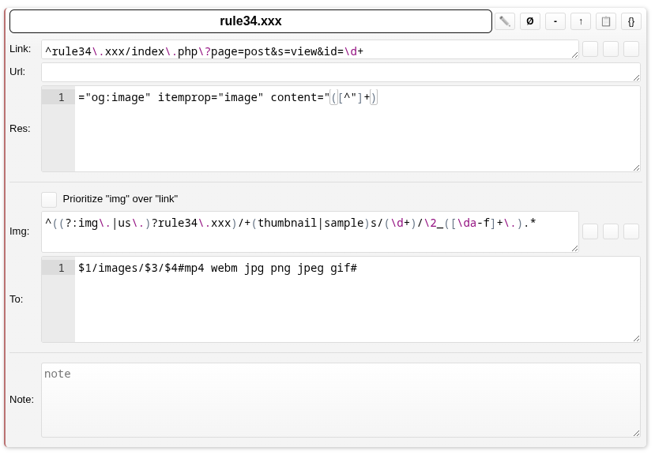

#  Rule34.xxx Improved
A lot of improvements for [rule34.xxx](https://rule34.xxx) 
## Click [here](https://github.com/kekxd666/rule34xxx-improved/raw/main/rule34_improved.user.js) to install.

Navigate to your account options page to view and customize all of your options. ([My Account > Options](https://rule34.xxx/index.php?page=account&s=options))
###### Tested on: [Violent Monkey](https://violentmonkey.github.io/get-it/) (recommended)

## Features (Options):
- Favorites Filter
- Endless Scrolling
- Show Fav Posts
- Hide Fav Posts
- Hide Blacklisted Thumbnails
- Enable Fav On Enter
- AutoPlay
- Default Video Volume
- Image/Video Height
- Stretch Image/Video
- True Video Size
- Force Dark Theme
- Better Dark Theme
- Remove Bloat
- Embed Video
- Thumb Fav
- Main Page Extra (Tag Bookmark, Superfav Gallery)
- SlideShow (for main posts page only tho, will add for favs too, in the future, :V, aka i'm a lazy mf)
- Control Video Volume With Scroll

## Imagus
### Install:

### Modify sieve to fix playing mp4 videos for rule34.xxx:

